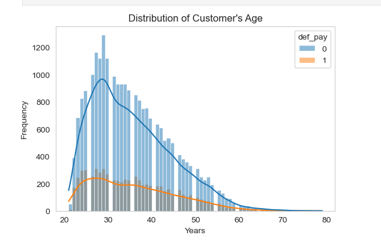
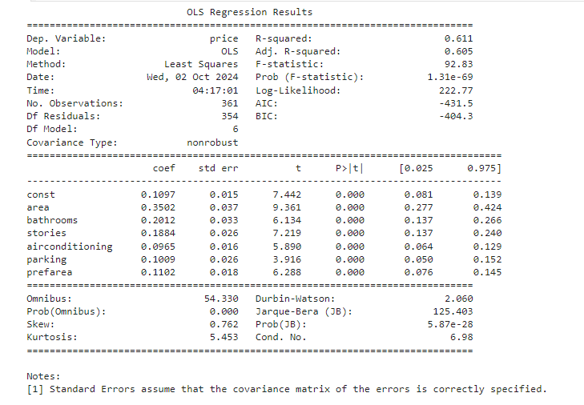

## Biography
 Hello! I'm Syed As-Sadeq Tahfim, holding a PhD in Management Science and Engineering from Dalian Maritime University, China. As a researcher and aspiring data scientist, I specialize in exploratory data analysis, statistical methods (e.g., regression analysis), and machine learning models such as decision trees, random forests, gradient-boosted trees, feed-forward neural networks, RNNs, and LSTMs. I also develop interactive dashboards using Streamlit. Currently, I'm working on a credit scorecard model for nano and micro-loans aimed at individuals and MSMEs. I’ve published several research articles, including one in an SCI/SSCI-indexed journal and two in EI-indexed research articles, focused on crash severity involving large trucks. Feel free to reach out at tahfim1963@outlook.com. 

    
    

    
    

## Connect with me
https://www.linkedin.com/in/syedtahfim1963/
