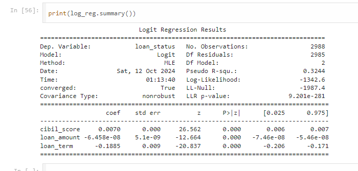
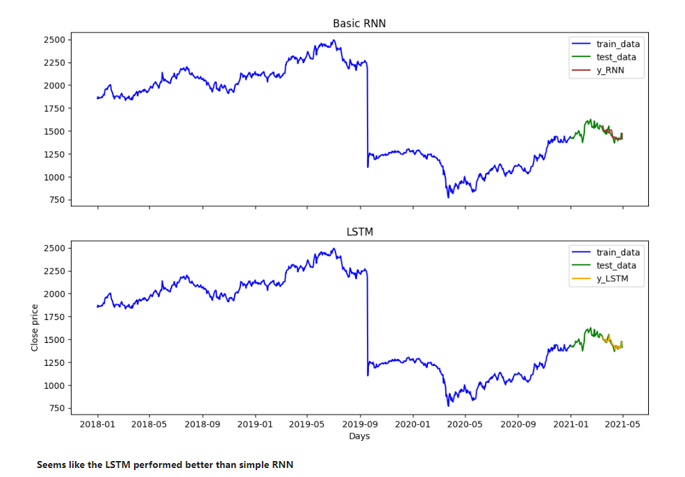

## Summary
 Data Scientist and Researcher with a PhD in **Management Science and Engineering** and proven expertise in credit risk modeling, financial forecasting, and SME finance. Skilled in **data warehousing, EDA, and statistical and machine learning models**. Well-versed in developing end-to-end machine learning projects. Published multiple peer-reviewed articles, including **SCI/SSCI- and EI-indexed** papers, with research focused on transportation safety. Proficient in Python, R, SQL, and modern data analysis frameworks, with strong capabilities in predictive modeling and real-world financial applications. Dedicated to bridging the gap between people, business, and technology. 

## In my git-hub profile, you will find the following projects. 
## - [Income Prediction](https://github.com/casper6020/Income-level-prediction-Adult-Dataset)
 Often times, data scientists and researchers are biased to advanced machine learning models because of their predictive power. Here, we compared logstic regression with two boosting algorithms and explained why boosting alrithms perform better than logistic regression. 

    

    
    

## Connect with me
https://www.linkedin.com/in/syedtahfim1963/
